# pytest-shm

**Put pytest's temporary files on the `/dev/shm` tmpfs, so tests that fsync stop waiting on the disk.**

<div style="text-align: center; margin: 2rem 0;">
  
</div>

Install it and run pytest.
On Linux it moves the temp root to `/dev/shm` when that is safe, keeps stray `tempfile` output inside pytest's base directory, and frees that directory when the session passes.
Everywhere else, and whenever you export `TMPDIR`, it leaves the temp root alone.

## Why pytest-shm?

SQLite commits, atomic file replacement, and anything else that promises durability call `fsync`, and on a real disk each call waits for the device.
A suite that exercises durable storage can spend most of its time there.
tmpfs lives in memory, so `fsync` returns immediately.

How much that saves depends on how much of your suite waits on `fsync`.
As one data point, in [MindRoom](https://github.com/mindroom-ai/mindroom)'s suite of about 26,000 tests, which commit SQLite transactions and atomic file writes throughout, summed test time on a 32-worker NVMe machine fell from 5236 s to 1426 s, and the GitHub Actions test step fell from about 16 to 12-15 minutes.
To measure your own suite, compare a plain `pytest` run with `pytest -o shm_min_free_gib=inf`, which keeps the plugin off.

No durability test can observe the difference.
Such tests simulate a crashed process, and a crashed process never needed its writes to leave the page cache.
The [caveats](caveats.md) list the differences other tests can see.

## Installation

```bash
uv add --dev pytest-shm
# or
pip install pytest-shm
```

It needs Python 3.10+ and pytest 8.4+, and pytest loads it automatically.
The report header tells you whether it is active:

```text
shm: temp root /dev/shm
```

or why it is not:

```text
shm: off, TMPDIR is exported
```

## Next steps

- [How It Works](how-it-works.md): what moves where, what gets cleaned up, and when the plugin stays off.
- [Configuration](configuration.md): the free-space threshold and how to turn the plugin off.
- [Caveats](caveats.md): what other tests can notice.
